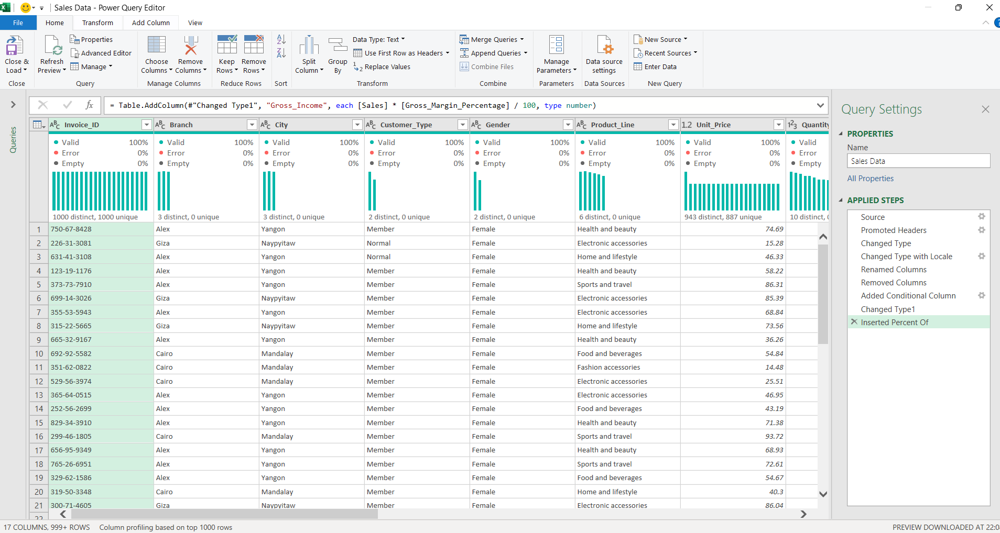
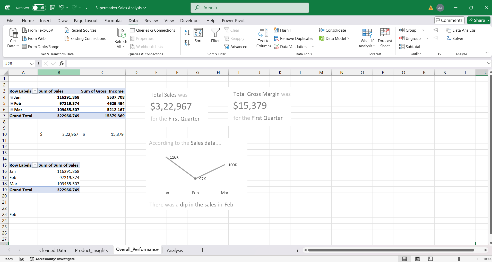
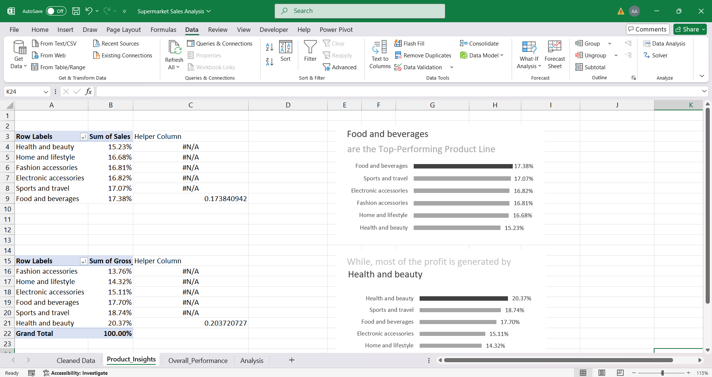

# ABC Mart: Q1 2019 Sales & Profitability Analysis

> This project is an end-to-end analysis of supermarket sales data performed entirely within Microsoft Excel. The primary goal was to transform raw transactional data into a dynamic, interactive dashboard that reveals key business insights and provides a clear, data-driven recommendation.

---

## 🎯 Project Objective

To analyze three months of sales data from the fictional supermarket chain, ABC Mart, in order to identify trends in sales, product performance, and customer behavior, ultimately leading to a strategic recommendation to enhance profitability.

---

## 🛠️ Tools & Technologies

- **Microsoft Excel:** Used for the entire project, including:
  - **Power Query:** For data cleaning, transformation, and preparation.
  - **PivotTables:** For data aggregation and analysis.
  - **Formulas & Charts:** For creating custom visuals and the final dashboard.
- **GitHub:** For version control and project showcase.

---

## ⚙️ Project Workflow

The project followed a structured data analysis workflow to ensure accuracy and clarity in the final presentation.

### 1. Data Cleaning and Preparation
The raw dataset was loaded into Power Query for robust cleaning. Key transformations included correcting data types for dates and times, standardizing column names, and creating a new "Hour" column to enable time-based analysis.

### 2. Data Analysis
PivotTables were the core analytical tool used to summarize the cleaned data across multiple dimensions. This allowed for the efficient calculation of totals, counts, and percentages needed to address the client's business questions.

### 3. Data Visualization
A comprehensive, single-page dashboard was designed to present all findings. Advanced visualization techniques were used, such as creating dynamic charts that automatically highlight the maximum value to draw the viewer's attention to key information.

---

## 📈 Key Findings & Insights

- **Sales Trend:** There was a noticeable dip in total sales during the month of February.
- **Top Seller:** **Food and beverages** emerged as the top-performing product line in terms of total sales revenue.
- **Top Profit Driver:** **Health and beauty** products generated the most profit.
- **Customer Value:** The membership program is effective, with **Member customers contributing 18% more** to total sales than Normal customers.
- **Peak Hours:** A clear **sales peak occurs in the evening around 7 PM**, indicating a popular time for shoppers.

---

## 💡 Final Recommendation

**Based on the Q1 sales analysis, the primary recommendation is to shift promotional focus from maximizing revenue to maximizing profitability by launching a targeted marketing campaign for "Food and beverage" items during the 7 PM sales peak.**

This strategy directly leverages the key insights from the data to create an actionable plan aimed at boosting the company's bottom line.

---

## 🚀 How to Interact with the Project

You can download the full Excel workbook from this repository to explore the interactive dashboard and the underlying analysis.
